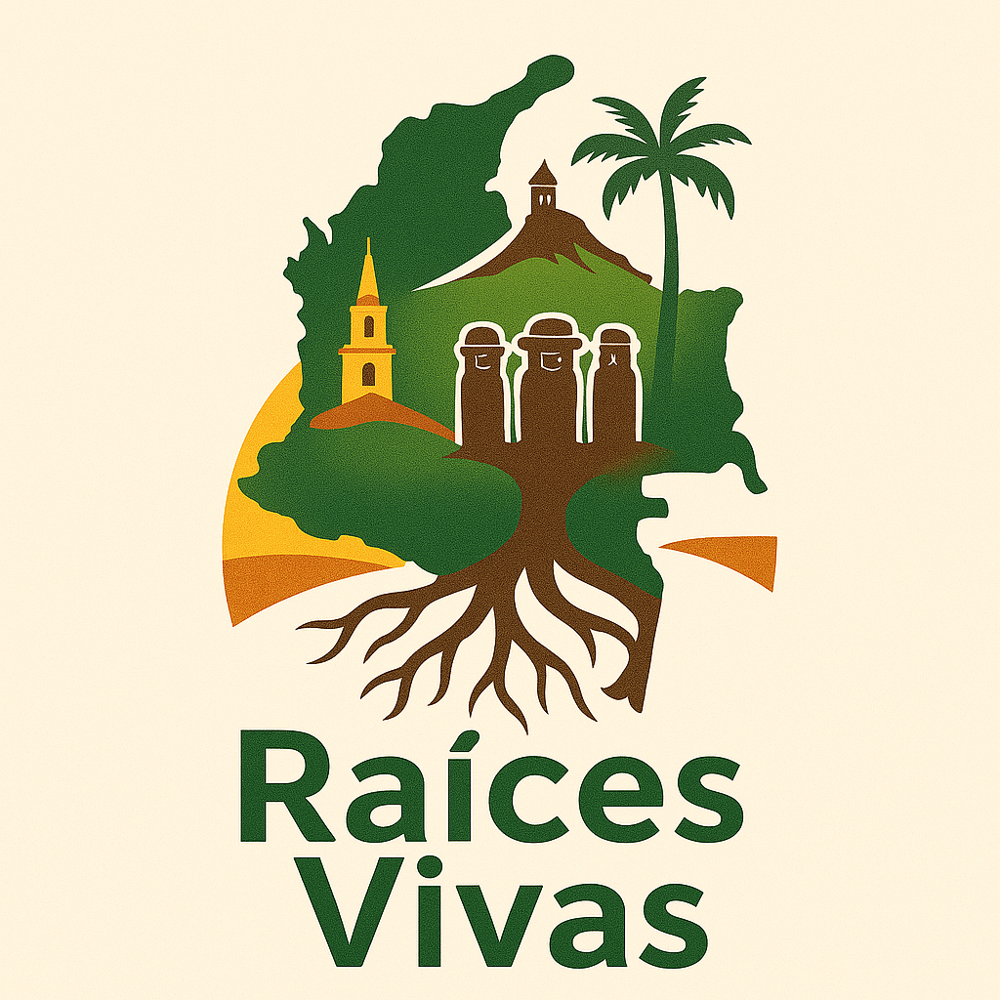

<!DOCTYPE html>
<html lang="es">
<head>
  <meta charset="UTF-8" />
  <meta name="viewport" content="width=device-width, initial-scale=1.0"/>
  <title>Raíces Vivas - Turismo con Comunidades de Colombia</title>
  
</head>
<body>
  <header>
    
    <h1>Raíces Vivas</h1>
    
Turismo con Comunidades de Colombia

  </header>

  <nav>
    <a href="#aliados">Formulario de Aliados</a>
    <a href="#mapa">Mapa Interactivo</a>
    <a href="#contacto">Contacto</a>
  </nav>

  <section id="aliados">
    <h2>Formulario para Aliados</h2>
    <form>
      <label for="nombre">Nombre completo:</label>
      <input type="text" id="nombre" name="nombre" required>

      <label for="correo">Correo electrónico:</label>
      <input type="email" id="correo" name="correo" required>

      <label for="mensaje">Mensaje:</label>
      <textarea id="mensaje" name="mensaje" rows="4" required></textarea>

      <button type="submit">Enviar</button>
    </form>
  </section>

  <section id="mapa">
    <h2>Mapa Interactivo</h2>
    <iframe src="https://www.google.com/maps/d/embed?mid=1R3DgPvjQ3GQjEpY0RK7YyYQ3X9E&hl=es" allowfullscreen></iframe>
  </section>

  <section id="contacto">
    <h2>Contacto</h2>
    
Correo: herrerajaramilloastridcarolina@gmail.com

    
WhatsApp: <a href="https://wa.me/573005866260" target="_blank">3005866260</a>

  </section>

  <footer>
    
&copy; 2025 Raíces Vivas - Turismo con Comunidades de Colombia

  </footer>
</body>
</html><!DOCTYPE html>
<html lang="es">
<head>
  <meta charset="UTF-8" />
  <meta name="viewport" content="width=device-width, initial-scale=1.0"/>
  <title>Raíces Vivas - Turismo con Comunidades de Colombia</title>
  
</head>
<body>
  <header>
    
    <h1>Raíces Vivas</h1>
    
Turismo con Comunidades de Colombia

  </header>

  <nav>
    <a href="#aliados">Formulario de Aliados</a>
    <a href="#mapa">Mapa Interactivo</a>
    <a href="#contacto">Contacto</a>
  </nav>

  <section id="aliados">
    <h2>Formulario para Aliados</h2>
    <form>
      <label for="nombre">Nombre completo:</label>
      <input type="text" id="nombre" name="nombre" required>

      <label for="correo">Correo electrónico:</label>
      <input type="email" id="correo" name="correo" required>

      <label for="mensaje">Mensaje:</label>
      <textarea id="mensaje" name="mensaje" rows="4" required></textarea>

      <button type="submit">Enviar</button>
    </form>
  </section>

  <section id="mapa">
    <h2>Mapa Interactivo</h2>
    <iframe src="https://www.google.com/maps/d/embed?mid=1R3DgPvjQ3GQjEpY0RK7YyYQ3X9E&hl=es" allowfullscreen></iframe>
  </section>

  <section id="contacto">
    <h2>Contacto</h2>
    
Correo: herrerajaramilloastridcarolina@gmail.com

    
WhatsApp: <a href="https://wa.me/573005866260" target="_blank">3005866260</a>

  </section>

  <footer>
    
&copy; 2025 Raíces Vivas - Turismo con Comunidades de Colombia

  </footer>
</body>
</html>
